# Using Command Line Git (in the lab)

## Starting a Lab Assignment or Lab Exam by Cloning a Repository
These steps will be repeated for Lab Exams and Lab Assignments:

1. For assignments you will be provided a repository invitation link.
2. You will follow the link, login to GitHub (if not already logged in) and accept the invitation.
3. This will create a new repository for you and a link will be provided for a repository that has been automatically created on your account.
   1. This repo provides you with all of the details and instructions for completing your work.
   2. You can follow the link to your repo to view it.
4. Create a folder for your repository. Navigate to this folder and right click to "Open in Terminal" 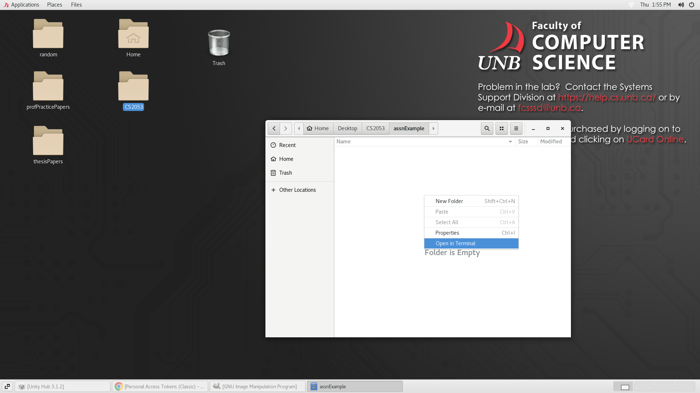
5. Copy the repository link under the green "Code" button on your GitHub repository, then type into the terminal (right click to paste):
   git clone [repository link]
   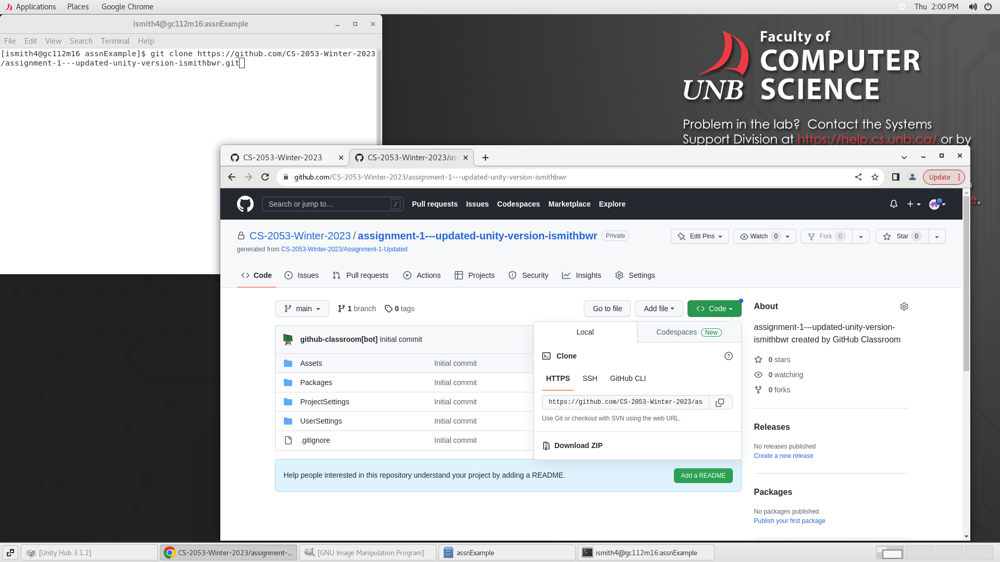
6. Type in your GitHub username, hit enter, then type in your GitHub password and hit enter. This may fail as shown below. 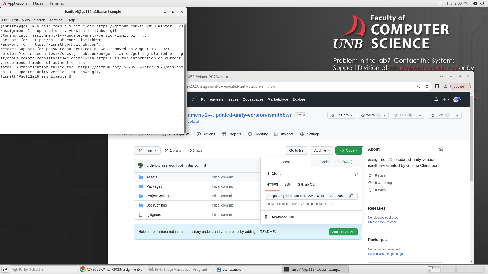
7. If it failed, you will need to replace your password with a personal access token from the GitHub website.
   1. On the Github website, go to "Settings" under your profile menu on the top right 
   2. Click "Developer Settings" on the bottom left 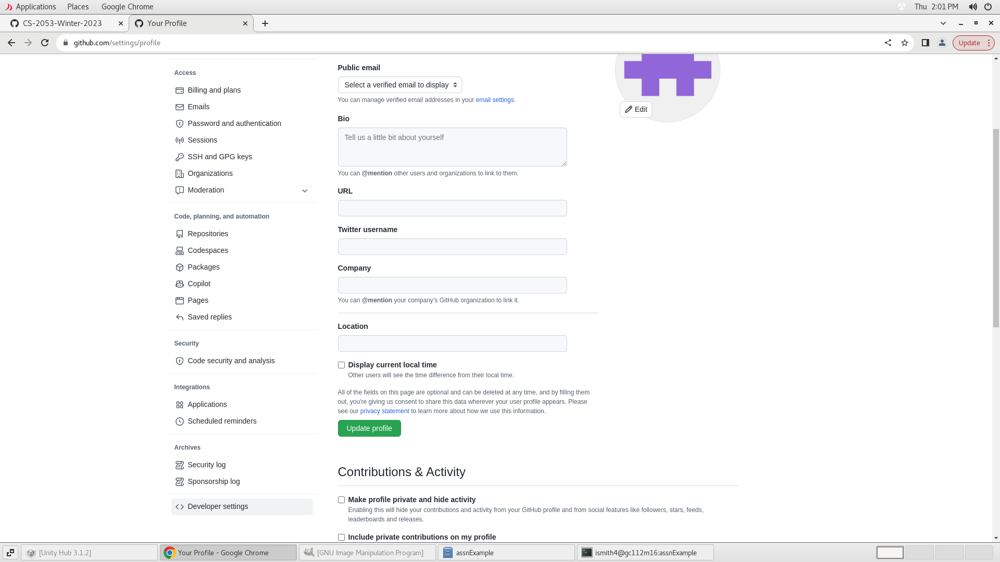
   3. Click "Tokens Classic" under "Personal access tokens" on the left 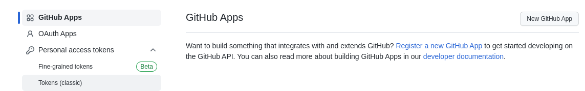
   4. Click "Generate new token (classic)" under the "Generate new token" menu on the top right 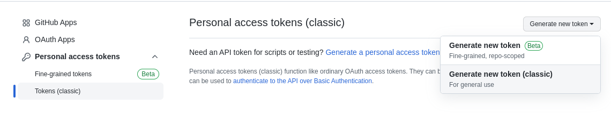
   5. Type anything into the "Note" box, then click the "repo" checkbox and press "Continue" on the bottom of the page 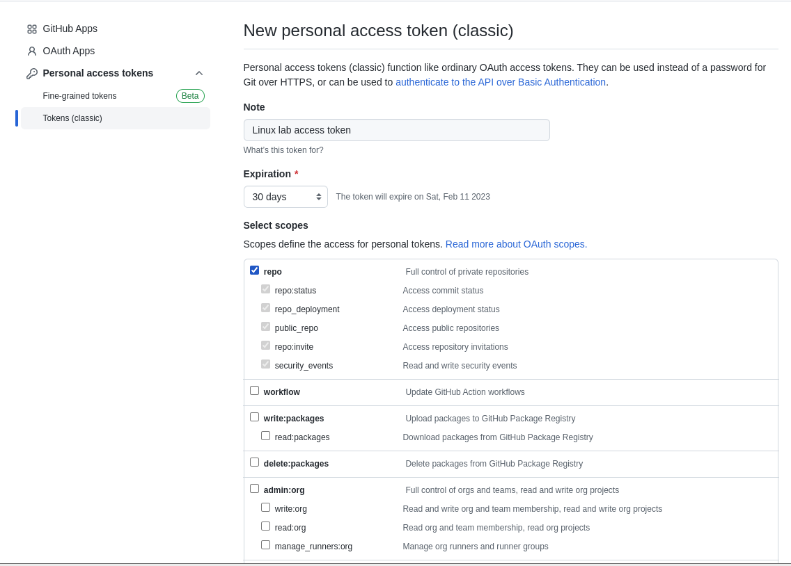
   6. Copy the string that is generated (this acts as a password, so I have covered mine up) 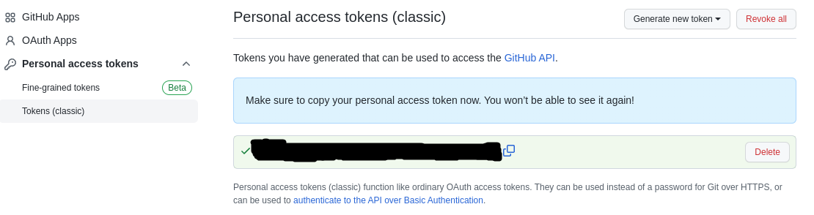
   7. Type the clone command into the terminal again, enter your username, but paste this token string as your password (then press enter) 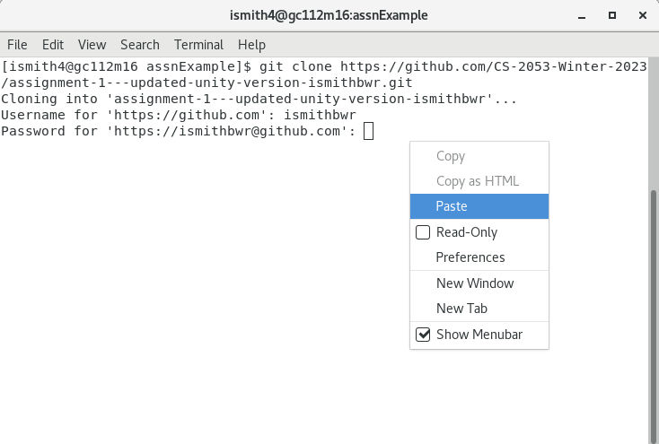
8. If successful with either approach, you should have created a new folder that looks like this! 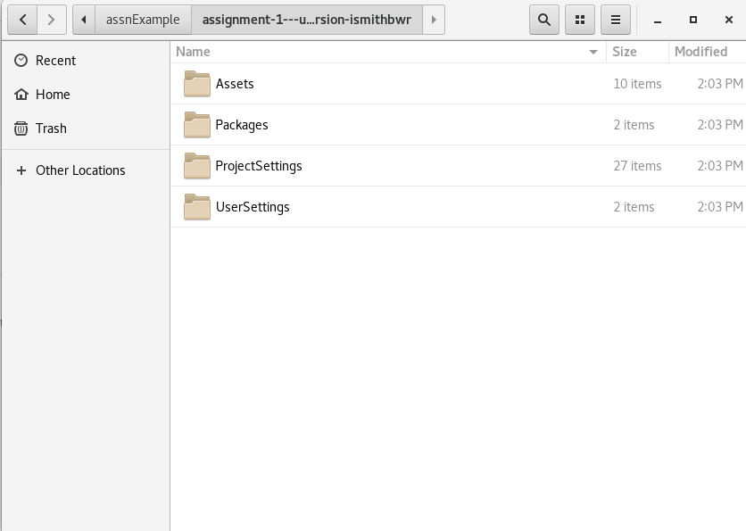
9. Now your project is downloaded and ready to work on! Open unity hub, and "Add project from disk" under the "Open" menu. 
10. Navigate to the assignment folder and hit "Add Project" 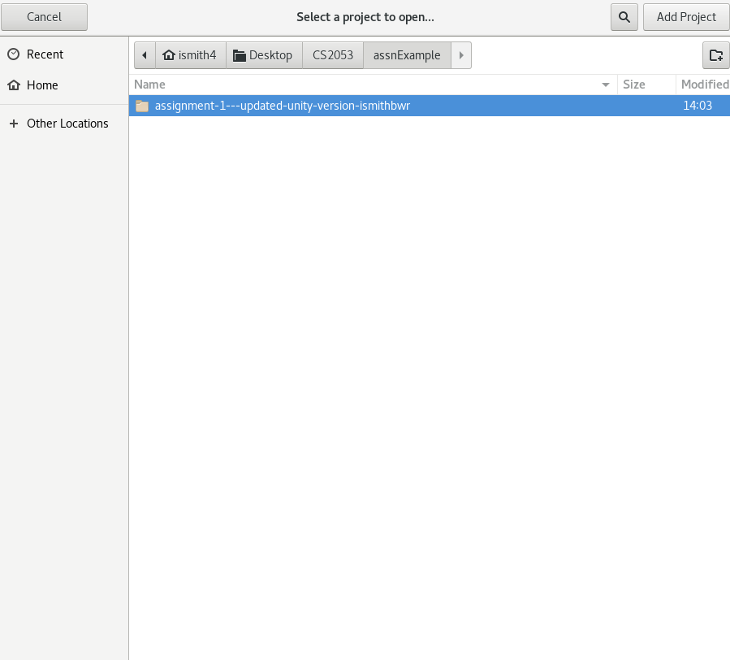
11. It may take a while to resolve the packages, just let it do it's thing... When it opens, do your work in unity and then save the project.
12. When you are done and saved, it's time to update your git repository. Type the following commands into the terminal, hitting enter after each:
   git add .
   git commit -m "Whatever name you want for this version of the code"
   git push origin main
   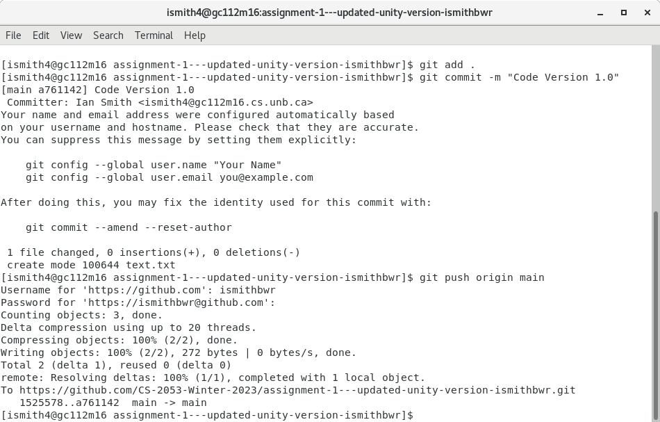
13. These commands stage the code (tell git which file changes you want it to save, . means everything in the folder), commit the code (create a 'checkpoint' of the state of your code on the computer), then push the commit (send the changes off to GitHub for cloud storage).
   1. Note that you may need to explicitly enter a username and name before the commit, follow the instructions in the terminal response
14. Double check that the push has gone through successfully by opening your repository on github.com, refreshing the page, and checking that the commit went through.
   1. You will always have an "Initial Commit" when the repository is created from my assignment template, but this example had a text.txt file added in the "Code Version 1.0" commit. (this file is irrelevant to Unity, just an easy thing to change and see). 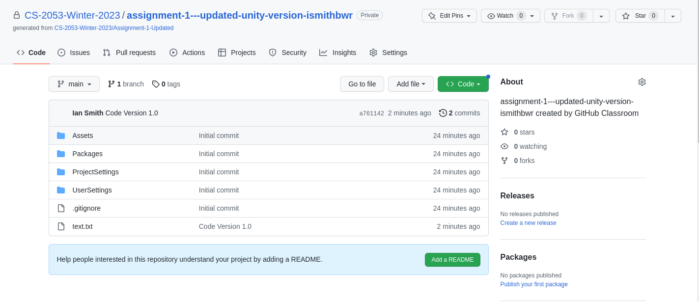

4. Open GitHub Desktop and Click "File -> Clone Repository"
5. Make sure that "GitHub.com" is selected at the top, and filter by typing in the name of your repo... For example, "Lab-Assignment-1" (without the quotes).
6. Select your repo from the list and choose a place on your local drive to "clone it to" (i.e., download it), and click "Clone".
7. Once cloned your newly cloned repository should be selected in your list under "Current Repository" in GitHub Desktop. You can change your selection in that list. If you need to work with different projects.
   1. Your repos for coursework will be private and should not be shared with any other students in the class. They are accessible by the instructor and TAs.
8. Once cloned you can open your repository in Unity. Open Unity Hub, make sure "Projects" is selected on the left hand menu, and click "Add". Navigate to the location on your computer where you cloned your repository to and click "Select Folder" on the top level directory of the project repo.
9. Next, select the "Unity Version" for your project. It should be the latest 2021.3.xx 
10. Finally, click on your project in the list to open it.
    1.  You can complete your work as normal, following the provided instructions. 

## Submitting Your Lab Assignment or Lab Exam - "committing" and "pushing" your code

GitHub provides you with a lot of flexibility with how you can complete your work. However, we will use it in a very simple way... and just "commit" your changes to your local repository, and "pushing" your commits to GitHub.

### Committing

1. First you must commit any changes you have. Open GitHub Desktop and make sure you have the correct repository selected under "current repository"
2. Once selected, confirm that all changes you have made are listed under the changes. You can inspect the contents of the files and their difference from previous versions, by selecting them in the "changed files" list.
3. Once you are satisfied, type in a short summary that describes your changed and click "Commit".
   1. Note you can commit as frequently as you like. This stores all incremental changes since the last commit locally on your computer (but not on GitHub)
4. Next you will need to Push your code to store it on the GitHub website so that it can be saved off of your computer and be accessible for grading.

### Pushing Your Code

You can also "push" code as frequently as you like to GitHub. This allows you to store all of your work and commit history to the "cloud".

For assignments and lab exams, we will grade only the most recent version of your code posted to GitHub before the deadline (unless otherwise agreed upon).

1. Make sure you have your project selected in GitHub Desktop and you have "committed" all your work (see steps listed above).
2. In the main window click the "Push origin" button. 
3. Your code should now be uploaded and stored on GitHub. To be safe it is always good practice that you can view your latest commits on the GitHub website to make sure everything as worked as intended.

## More Details on How to Use Git
There are lots of great Git learning resources online like the free [Pro Git Book](https://git-scm.com/book/en/v2), if you would like to know more about how to use Git.
