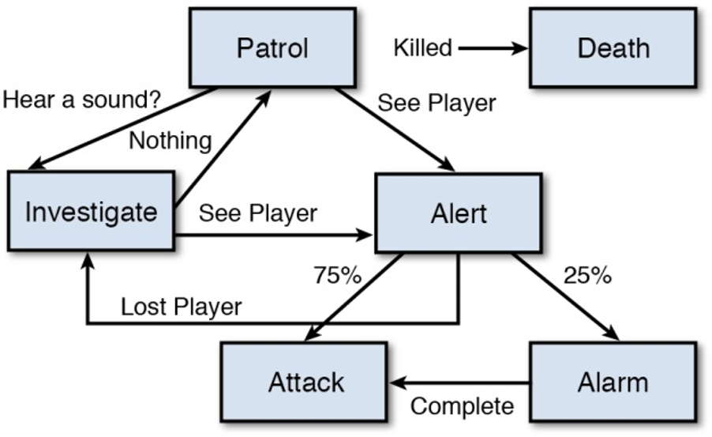
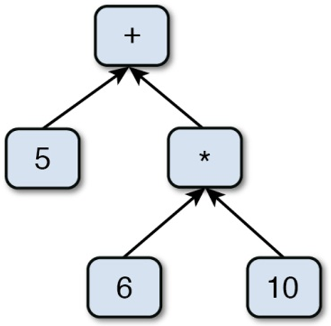

# CS2053 Game Programming Concept Assignment 3

## Due: 5 pm, Tuesday April 4, 2023

Answer the following questions related to chapters 9 - 12  of the textbook.

Create your repository with this [link](https://classroom.github.com/a/2ANQmorh).

 1. Complete the pseudocode below to detect if two spheres have collided.

```cs
    struct Sphere3D
    {
        float radius;

        //coordinates of the center point
        float x, y, z;
    }

    bool SpheresCollide(Sphere3D s1, Sphere3D s2)
    {
        //recall that the Pythagorean theorem in 3D is sqrt(a*a + b*b + c*c)
    }
```

 2. In games, collisions between characters are usually not very precise, as often times the arm or leg of one character will penetrate into another character. If precise collision detection is employed, what problems or issues might arise? What advantage does modeling character-character collisions with spheres or cylinders/capsules offer?

 3. Before a ball hits the wall it's speed is 150 units/second, after it hits a wall the speed becomes 200 units/second. Calculate the Coefficient of Restitution. What type of collision would this be when considering this coefficient? In what game scenario might this make sense?

 4. For the picking problem (using a mouse to select an object in a 3D world), after applying the unprojection matrix (by inverting matrix multiplication of camera matrix and projection matrix), we can compute the picking point A0 on the near plane (Z=0) and picking point A1 on the far plane (Z=1) in the 3D camera view. What else needs to be done to select a 3D object based on this approach?

 5.  Design a FSM (Finite State Machine) for behavior of an AI soccer player. The FSM should have 4 or more states and state transitions between them based on some events. Draw a diagram similar to the one below to represent the potential states of the player. Provide details about the transition on the arcs between states. You can add an image file for your drawing to the "images" folder of the repository, and link it here by replacing the file name.

 
6. Why is A* typically preferred over Best-First and Dijkstra algorithms?

7. Write pseudocode for how you might provide localization in 4 different languages, including what the data structures might look like. Show how the code and data might be implemented for a button that says "Start", keeping in mind that your data structures would need to be scalable for hundreds or thousands of text elements.

8. Draw an abstract syntax tree (AST) for calculating distance between 2 different 3D points, A and B. You can consider their x components Ax and Bx, etc. I'm looking for a mathematical AST, not code.


9. You are playing an MMORPG that has 3 dedicated servers in different parts of the world. Describe the process by which your computer would choose which server to connect to, including how data is sent and what data is sent.